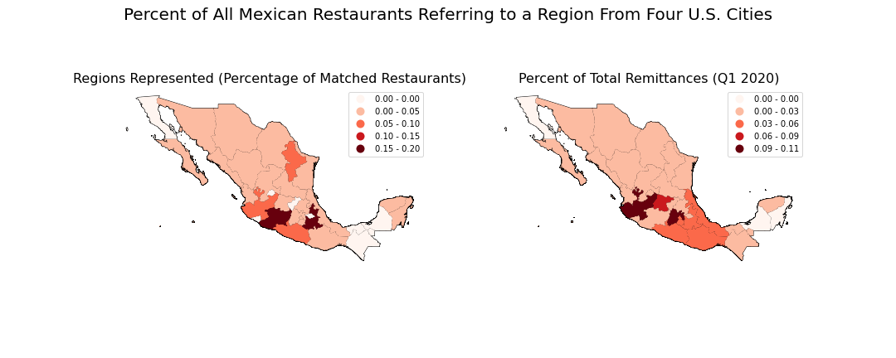

# Mexican Immigration Through Restaurant Names

## Description
Mexican immigration to the United States has a long and interesting history. There are 4 major periods to this migration that have led people of Mexican descent to live where they do today. In this project, **I aim to discover more about the home regions of Mexicans in 4 major cities with a significant Mexican-heritage population: New York City, Chicago, Dallas and San Francisco**. 

### Historical Background
Mexican Immigration to the United States is [generally characterized])(https://oxfordre.com/americanhistory/view/10.1093/acrefore/9780199329175.001.0001/acrefore-9780199329175-e-146) by (economic) _pull_ factors to the United States with certain periods of Mexican history creating _push_ factors for migration. Traditionally, Mexican men worked in agriculture in the American Southwest and waited until the next harvest either by returning to Mexico or temporarily living in nearby U.S. cities. It wasn't until the Great Depression where anti-immigrant sentiment started making this porous U.S.-Mexico border closed. The closing of the border generally progressed until the current situation. 

Starting in World War 2, Mexican labor was needed to fill the gaps in labor left by the war. From there, Mexican labor began diversifying and moving beyond the American Southwest. This was even more so after the Immigration Control and Reform Act of 1986 (IRCA). This law aimed to end illegal immigration by granting citizenship to all Mexican immigrants who arrived pre-1982. This led to those already in the U.S. to [bring their families and seek out a life in the United States](https://oxfordre.com/americanhistory/view/10.1093/acrefore/9780199329175.001.0001/acrefore-9780199329175-e-146). Coinciding with this diversification of employment was a diversification in the regions in Mexico where people came to the U.S.: instead of coming mainly from rural Mexico, [all economically disadvantaged regions had people coming to the U.S](https://oxfordre.com/americanhistory/view/10.1093/acrefore/9780199329175.001.0001/acrefore-9780199329175-e-146). With all of this history in mind, I wanted to try to find out if this manifested at all in the origins of Mexicans in U.S. cities. Are there more people from urban Mexico in New York City than in a more traditional Mexican immigration stronghold like San Francisco?

### Project Goals
This project aimed to use the outward representations of Mexican restaurants in American cities with a large Mexican population to determine the home origins of these people. If many restaurant names featured references to a certain region, the owner(s) and/or some people who work at that restaurant are certainly from that region. In either case, the region associated with that restaurant is meant to attract customers. Using a database of cities and terms that refer to specific regions of Mexico, I connect the words in Mexican restaurant names to those regions. In this way, I am capturing a subset of the population, but hopefully one that unbiasedly and fairly captures characteristics of the total population in the cities discussed here. It is my hope that **by analyzing the restaurant names we can learn more about the origin of Mexican immigrants in the United States**.

### Results
We see noticable differences in the proportion of the regions referred to in restaurant names for each of these cities. Many more people in NYC are from Puebla ([_Mixteca Baja_](https://en.wikipedia.org/wiki/La_Mixteca)) than we see in any of the other cities measured. Similarly, _36_% of Dallas's Mexican restaurants are connected to Michoacàn. Overall, we see the lack of a clear pattern in which regions Mexicans come from and where they end up in the United States. Although certain clusters emerge (Pueblans in NYC, Michoacànos in Dallas ), no Mexican region dominates any U.S. city.

Although not expected, we also see strong evidence of chain migration to specific regions, and even villages, of the United States. In New York City, we see 5 of the 69 restaurants refer to one <10,000 person town in Mexico ([Tulcingo](https://es.wikipedia.org/wiki/Municipio_de_Tulcingo)). It may even be that more people from Tulcingo del Valle, Puebla, Mexico live in NYC than in the town itself! It is almost certain that the people from Tulcingo in NYC are part of a tight-knit community that encouraged each other to move to NYC. 

Overall, the regions represented mirror those regions that receive the most remittances from Mexicans living in the United States. In both cases, we see that most of the Mexicans living in the U.S. come from Central Mexico. In particular, the mainly rural regions on the Pacific coast of Central Mexico (Jalisco, Michoacàn, etc.) are well represented. This commonality leads me to believe that this method is a fruitful one in determining the origins of Mexicans living in the U.S.

### Shortcomings
This project is suggestive, but should not be taken as fact or proof concerning Mexican regional migration to the United States. Crucially, this project rests on the assumption that 
    1. People from different regions of Mexico will set up restaurants in about equal proportion and 
    2. People from different regions of Mexico will display their regional identity in their restaurant names in about equal proportion. 
Both of these are untested and could be incorrect. Additionally, if employment opportunities for Mexicans are different in the four cities studied, then perhaps there will be far fewer restaurants and more laborers (Chicago and San Francisco certainly appear that way). Hopefully by looking at the percentage of all region-referring Mexican restaurants, this problem is reduced. Moreover, there is the problem of the officialness of restaurants: what I was able to find from city food inspection data likely under-represents the true number of restaurants in these cities. Last, matching the restaurant names to restaurants has a few problems. For one, the matches themselves were sometimes questionable: originally, "Jalisco" was connected to "Mexico City", instead of the region "Jalisco" (this was corrected). There were about 20,000 entries, so it was impossible to control for all errors. More commonly, there is the judgment call of determining if a word in a restaurant name is referring to a specific city in Mexico. Some restaurants had "alamo" in their name, does this refer to a village in Tabasco, a poplar tree (its translation) or the alamo in Texas? I decided which region matching words were legitimate by searching for each term on wikipedia and make a judgment call. The data is available in case someone more familiar with Mexico and these restaurants cares to correct me. Regardless, they should have a relatively small effect on the percentage of restaurants being pegged to specific regions in Mexico. 

## Technologies Used
- Jupyter Notebook
- Python
    - Pandas
    - Folium
    - GeoPandas
    - Shapely
    - Unidecode146
    - wikipedia 
    - Seaborn
    - Matplotlib
